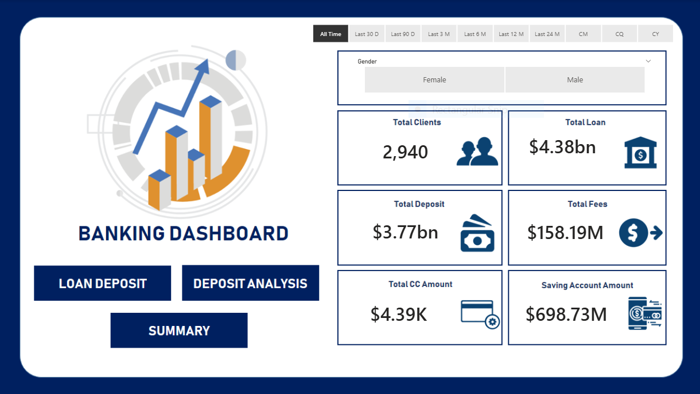
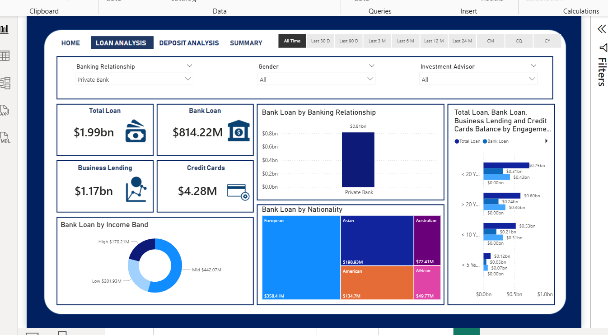
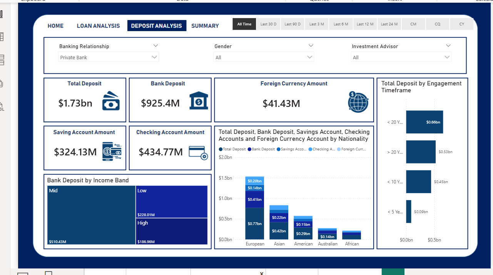
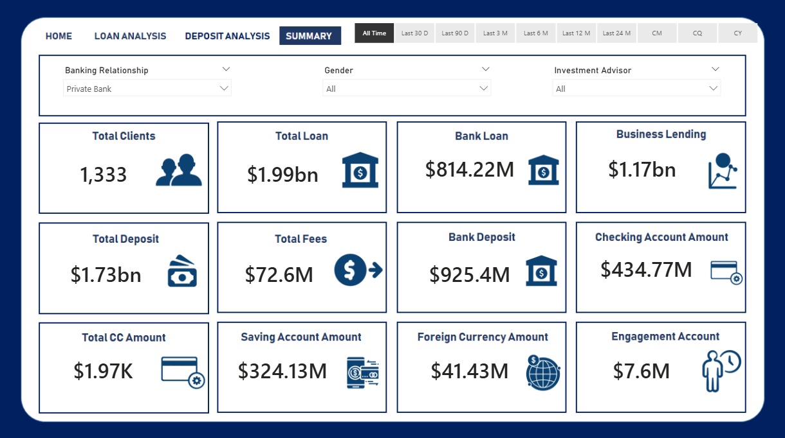

# Banking Analysis Project

## Project Overview
This project analyzes banking and client data to understand risk analytics and support decision-making in financial services. Using *Power BI dashboards, **Python, and **SQL*, we aim to identify clients likely to repay loans, optimize banking operations, and provide actionable insights.

*Problem Statement:*  
Retail and banking sectors face risk in lending due to lack of proper analysis of client profiles. This project provides insights to minimize the risk of non-repayment and optimize bank operations.

*Solution:*  
Interactive Power BI dashboards were developed to provide decision-makers with clear KPIs, enabling banks to approve loans based on client profiles and monitor banking performance efficiently.

---

## About Dataset
The datasets contain client and banking transaction details across multiple tables:

*Tables:*
- Banking Relationship
- Client-Banking
- Gender
- Investment Advisor
- Period

*Data Insights:*  
- Tables are linked via primary and foreign keys.  
- Dataset includes banking deposits, loans, fees, accounts, and client engagement details.

---

## Data Cleaning & Preparation
- Created Engagement Timeframe column to track client time in bank.  
- Created Engagement Days column showing days from joining date.  
- Categorized Estimated Income into bins: Low (<100,000), Mid (<300,000) → Income Band.  
- Added Processing Fees column: 0.05 if fee structure is high.  
- Handled null values, standardized column names, and merged tables as needed.

---

## Calculated Columns & Measures (DAX)

| Measure | Description | Example |
|---------|------------|---------|
| *Sum* | Adds numbers in a column | Bank Deposit = SUM('Clients - Banking'[Bank Deposits]) |
| *DistinctCount* | Counts unique values | Total Clients = DISTINCTCOUNT('Clients - Banking'[Client ID]) |
| *SUMX* | Sum evaluated for each row | Total Fees = SUMX('Clients - Banking',[Total Loan]*[Processing Fees]) |
| *SWITCH* | Conditional expression | SWITCH(<expression>, <value>, <result>...) |
| *DATEDIFF* | Difference between two dates | Engagement Days = DATEDIFF('Clients - Banking'[Joined Bank], TODAY(), DAY) |

---

## Key KPIs
- *Total Clients:* Number of clients in the bank.  
- *Total Loan:* Sum of Bank Loan + Business Lending + Credit Card Balance.  
- *Bank Loan:* Total loans to be repaid by clients.  
- *Business Lending:* Loans given to small businesses.  
- *Total Deposit:* Bank Deposits + Savings + Foreign Currency + Checking Accounts.  
- *Total Fees:* Fees charged for account setup and maintenance.  
- *Engagement Length:* Total days of client engagement.  
- *Credit Card Balance, Checking, Savings, Foreign Currency Amounts:* Detailed account balances.

---

## Visualization & Dashboard
- *Home Dashboard:* Overview of clients, deposits, and loans.  
- *Loan Analysis:* Interactive visualizations to assess loan distribution.  
- *Deposit Analysis:* Insights on various deposit types and account balances.  
- *Summary Dashboard:* Consolidates all KPIs for decision-making.

*Screenshots:*  
  
  
  
  

---

## Conclusion
Power BI dashboards provide actionable insights into client behavior, loan repayment risk, and bank operations. The interactive visualizations help banks make informed decisions and improve profitability.

---

## Future Work
- Identify bank types with maximum clients to strategize client acquisition.  
- Provide nationality-wise insights for targeted loan products.  
- Optimize account management and fee structures.  
- Extend analysis to predict loan default probabilities using machine learning.

---

## Technologies Used
- *Python:* Pandas, NumPy, Matplotlib, Seaborn for EDA and cleaning  
- *SQL:* Data extraction and aggregation  
- *Power BI:* Dashboards, interactive visualizations, DAX  
- *Excel / CSV:* Data storage and preparation  

---

## Prepared By
*Isha Mumtaz*

### Note / Acknowledgment

This project was inspired by publicly available tutorials and dashboards to understand banking analytics workflows. All analysis, cleaning, and visualizations were completed independently.